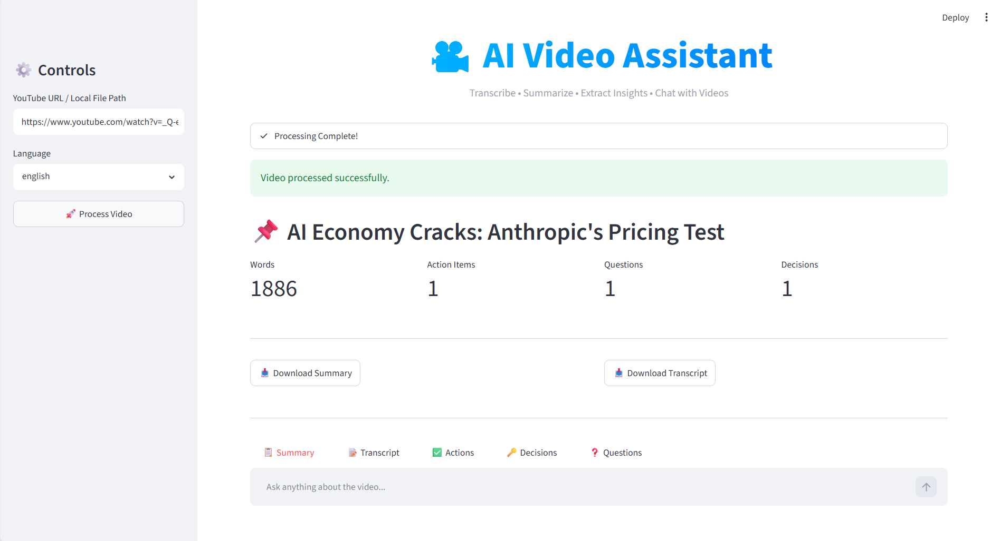
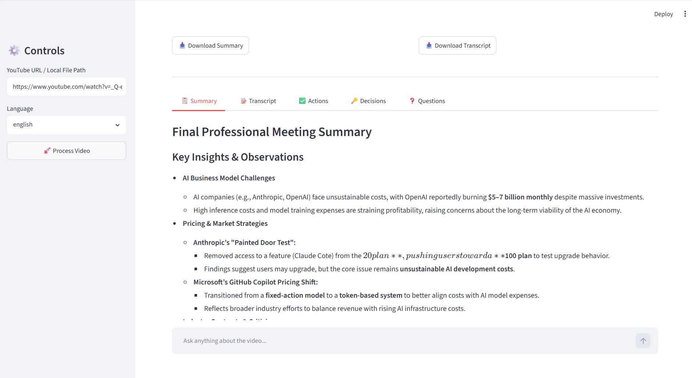

# 🎥 AI Video Assistant

An AI-powered video intelligence platform that transforms YouTube videos and local media files into actionable insights.

The system leverages a hybrid transcription pipeline—using **Whisper for English content** and **Sarvam AI for Hindi content**—to generate a unified English transcript, produce structured summaries, extract key insights, and enable conversational question answering through Retrieval-Augmented Generation (RAG).

---

### Home Page





### Summary Dashboard





## ✨ Features

### 🌍 Multi-Language Video Understanding

* **English Videos** → Transcribed locally using Whisper.
* **Hindi Videos** → Transcribed and translated into English using Sarvam AI.
* Generates a unified English transcript regardless of source language.
* Enables consistent summarization and question answering across languages.

### 🎙️ Automatic Speech-to-Text

* Supports YouTube videos.
* Supports local audio/video files.
* Chunk-based processing for long recordings.
* Automatic language-specific transcription pipeline selection.

### 📋 AI-Powered Summarization

* Generates concise summaries from lengthy content.
* Produces structured insights for faster understanding.
* Handles long transcripts through chunk-wise summarization.

### ✅ Action Item Extraction

* Identifies tasks and follow-ups discussed in the content.
* Highlights actionable takeaways automatically.

### 🔑 Key Decision Detection

* Extracts important decisions and conclusions.
* Useful for meetings, discussions, and interviews.

### ❓ Open Question Identification

* Detects unresolved questions and discussion points.
* Helps track pending items and follow-ups.

### 🧠 Retrieval-Augmented Generation (RAG)

* Builds a searchable knowledge base from transcripts.
* Enables contextual question answering.
* Grounds responses using transcript content.

### 💬 Conversational Video Chat

* Chat with videos using natural language.
* Ask follow-up questions about specific topics.
* Receive transcript-aware responses.

### 🎨 Modern Streamlit Interface

* Interactive dashboard.
* Processing status tracking.
* Downloadable summaries and transcripts.
* ChatGPT-style chat experience.

---

## 🏗️ System Architecture

```text
YouTube URL / Local File
            │
            ▼
     Audio Processing
            │
            ▼
 ┌───────────────────────┐
 │ Language Selection    │
 └───────────────────────┘
            │
     ┌──────┴──────┐
     ▼             ▼

 Whisper       Sarvam AI
(English)       (Hindi)

     ▼             ▼
     └──────┬──────┘
            ▼

   English Transcript
            │
 ┌──────────┼──────────┐
 ▼          ▼          ▼

Title    Summary   Insight Extraction

                     │
                     ▼

             Action Items
             Key Decisions
             Open Questions

                     │
                     ▼

                 RAG Layer

                     │
                     ▼

           Conversational QA
```

---

## 📂 Project Structure

```text
AI_Video_Assistant/
│
├── app.py
│
├── core/
│   ├── transcriber.py
│   ├── summarize.py
│   ├── extractor.py
│   ├── rag.py
│   └── vector_store.py
│
├── utils/
│   └── audio_processor.py
│
├── .streamlit/
│   └── config.toml
│
├── requirements.txt
├── .env
└── README.md
```

---

## ⚙️ Tech Stack

### AI & NLP

* Whisper
* Sarvam AI
* LangChain
* Mistral AI

### Retrieval

* ChromaDB
* Vector Embeddings
* Retrieval-Augmented Generation (RAG)

### Frontend

* Streamlit

### Audio Processing

* FFmpeg
* Pydub
* yt-dlp

---

## 🚀 Installation

### Clone Repository

```bash
git clone https://github.com/your-username/AI-Video-Assistant.git

cd AI-Video-Assistant
```

### Create Virtual Environment

```bash
python -m venv .venv
```

### Activate Environment

#### Windows

```bash
.venv\Scripts\activate
```

#### Linux / Mac

```bash
source .venv/bin/activate
```

### Install Dependencies

```bash
pip install -r requirements.txt
```

---

## 🔑 Environment Variables

Create a `.env` file in the project root.

```env
MISTRAL_API_KEY=your_mistral_api_key

SARVAM_API_KEY=your_sarvam_api_key

WHISPER_MODEL=small
```

---

## ▶️ Running the Application

```bash
streamlit run app.py
```

The application will launch in your browser.

---

## 💡 Supported Workflows

### English Content

```text
Video
   ↓
Whisper
   ↓
English Transcript
   ↓
Summary + RAG + Insights
```

### Hindi Content

```text
Video
   ↓
Sarvam AI
   ↓
English Transcript
   ↓
Summary + RAG + Insights
```

---


### Home Page

```markdown

```

### Summary Dashboard

```markdown

```

### Conversational Chat

```markdown

```

---

## 🎯 Use Cases

* Meeting analysis
* Lecture summarization
* Interview review
* Podcast understanding
* Webinar insights
* Research content extraction
* YouTube knowledge assistant

---

## 🔮 Future Improvements

* Additional language support
* Speaker diarization
* PDF report export
* Meeting minutes generation
* Video chapter generation
* Cloud deployment
* User authentication
* Conversation history persistence

---

## 📜 License

This project is licensed under the MIT License.

---

## 👨‍💻 Author

**ULISETTI SAKETH UZVAL KRISHNA**


